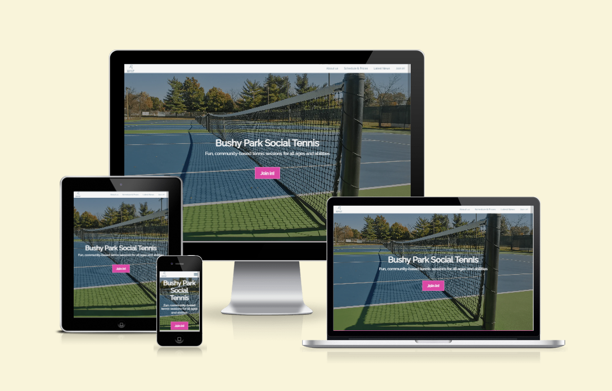
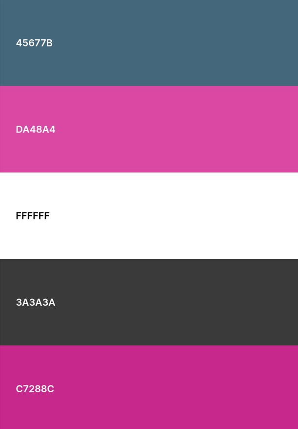
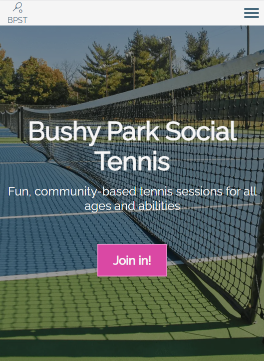
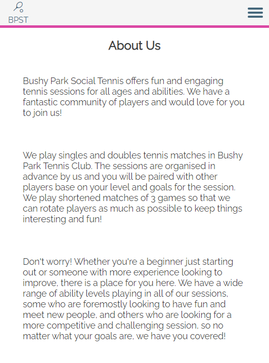
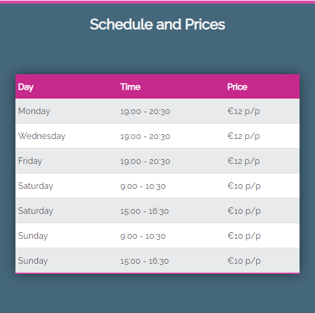
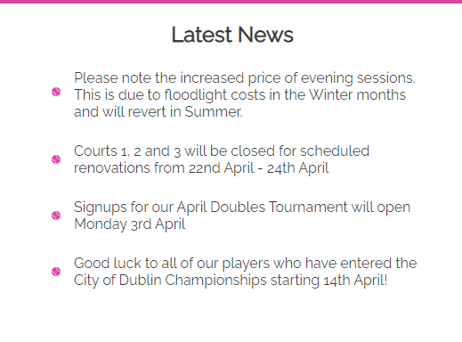
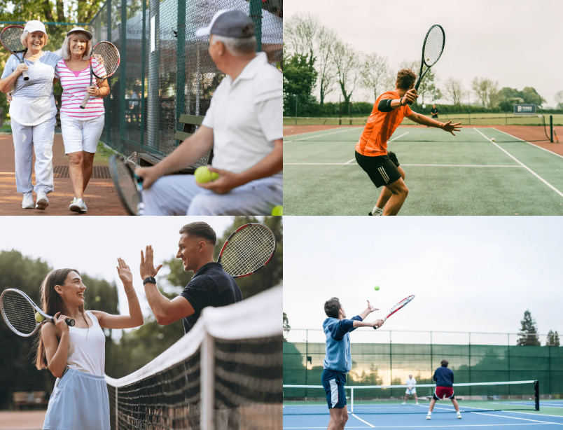
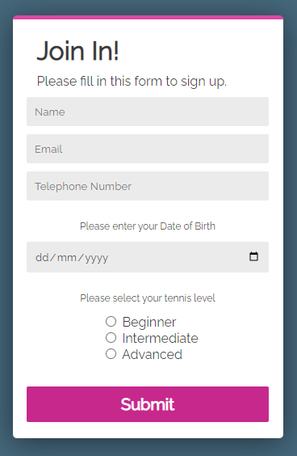

# BUSHY PARK SOCIAL TENNIS

The Bushy Park Social Tennis website is a site that informs visitors about Bushy Park Social Tennis. The site is targeted primarily towards would-be customers of Bushy Park Social Tennis. Users of the site will be able to see an overview of what the Social Tennis is, as well as learn more details about the sessions including times, prices etc. 

The site gives viewers a snapshot of Social Tennis via the Latest News section and images, and also allows users to sign up to Social Tennis via a signup form.

## UX

The site was designed with clarity and simplicity in mind. The site attempts to deliver the salient information in a clear and accessible way, without clutter. 

The navigation bar takes the user to all areas of the site and sticks at the top of the page while the user scrolls so that any section of the site is accessible at any time.

Smooth scroll behaviour was used to help to inform the user that scrolling of the site is possible and to give the user a better sense of the full layout of the site as they use the links in the navigation bar.

The form section (form.html) was created as a separate page in order to help the user to focus solely on the details of the form, without the possible distraction of other information on the screen.

### Colour Scheme

The site utilizes mainly neutral colors in textual and image elements with bright contrasting pink elements to draw the user's attention.

Main colors were picked to be roughly "tennis-themed" with neutral blues and greens to blend with tennis court colors.

Colour tools such as https://www.colorhexa.com/ & https://palettegenerator.com/ were used to analyze image color palletes and find contrasting standout colours as well as colors to blend and accent.

- `#ffffff` used for primary text.
- `#da48a4` used for primary highlights.
- `#3a3a3a` used for secondary text.
- `#45677b` used for background color
- `#c7288c` used for accessibility alternative to `#da48a4` where needed

Color Palette https://coolors.co/45677b-da48a4-ffffff-3a3a3a-c7288c

### Typography

Google Fonts and Font Awesome libraries were used. 

The "Raleway" Google font was used for all text elements on the site.

- [Raleway](https://fonts.google.com/specimen/Raleway) 

Font Awesome was used for icons used in the footer and elsewhere.
- [Font Awesome](https://fontawesome.com)

Google Fonts was also used for the material icon of the tennis racquet and ball in the logo of the site.

## Features

### Existing Features

- **Landing Page**

This is what the user sees on first arrival to the site. The hero image tells the user instantly what the site is about, along with the Bushy Park Social Tennis heading. Below this, the subheading gives a short description, further cementing the idenity of the site on first arrival.

The main focus on this page is the large striking "Join In!" button, giving the user an immediate call to action.

- **About Us**

This section provides information on what Bushy Park Social Tennis is. It gives the user an overview of Social Tennis, how the sessions are organised, the format of the sessions and how the sessions will run.

This section also seeks to assuage any trepidation a user of the site may have about taking part in Social Tennis. The user is made to feel welcome, taken care of, and therefore more likely to sign up.

- **Schedule and Prices**

    In this section, the user is presented with all of the schedule and pricing information they might need, in a very easy to read table. Users can immediately see t what time and on which days there is a Social Tennis session, as well as checking the price for that session. 

    Providing this information in this way helps to provide clarity to the user, as well as informing them of the many options for Social Tennis available to them, increasing the chance of that user signing up.

- **Latest News**

    This section provides users of the site with up to date information about Social Tennis. Returning users of this site willl find useful information here regarding future sessions. 

    This section also serves to provide new users with a way of seeing that Social Tennis is an active event which is currently operating. Up to date news items show new users that the site, and therefore the event are still taking place.

- **Image Gallery**

    The images in this section give users a glimpse at what Social Tennis will look like, and the clientele that take part. Images were selected to represent a wide range of ages and levels of competition in order to demonstrate to potential signups that they will be welcome and among similar people at Social Tennis.

    The images can be hovered over (or tapped on mobile/tablet) to see details of the photo, including names of the people in the photo and the date the photo was taken, as well as showing the attribution for the photographer and a link to their instagram page.

- **Signup Form**

 This form provides new users with a simple way of signing up for Bushy Park Social Tennis. The form is on a separate page to keep the user's focus solely on the form, but retains the same styling as the rest of the site, so as not to feel divorced from the main sections of the site.

 The form asks for all the details required by Bushy Park Social Tennis, and requires the user to fill out all sections. On completion of the form, the user is presented with a simple confirmation page, again retaining the syling of the main site, and after a brief moment, returned to the main site to further explore.
    

### Future Features

 - Members section
     - this would be a section of the site where users could login and see user-specific information such as fees and bookings, as well as connect with other members and arrange matches.
- Shopping elements
     - users of the site could pay in advance for Social Tennis sessions using the site. Vouchers could also be purchased.

## Tools & Technologies Used

- [HTML](https://en.wikipedia.org/wiki/HTML) used for the main site content.
- [CSS](https://en.wikipedia.org/wiki/CSS) used for the main site design and layout.
- [JavaScript](https://www.javascript.com/) used for auto-closing the responsive burger menu.
- [CSS Flexbox](https://www.w3schools.com/css/css3_flexbox.asp) used for an enhanced responsive layout.
- [Git](https://git-scm.com) used for version control. (`git add`, `git commit`, `git push`)
- [GitHub](https://github.com) used for secure online code storage.
- [GitHub Pages](https://pages.github.com) used for hosting the deployed front-end site.
- [Gitpod](https://gitpod.io) used as a cloud-based IDE for development.
- [Markdown Builder by Tim Nelson](https://traveltimn.github.io/markdown-builder) used to help generate the Markdown files.
- [Google Fonts](https://fonts.google.com/) used for fonts on the site
- [Color Hexa](https://www.colorhexa.com/) used to generate contrasting and complementary colors 
- [Palette Generator](https://palettegenerator.com/) used to generate color palettes based on image colors
- [Web AIM](https://webaim.org/resources/contrastchecker/) used to check color contrast for accessibility purposes
- [Dimensions](https://chrome.google.com/webstore/detail/dimensions/baocaagndhipibgklemoalmkljaimfdj?hl=en) Chrome extension used to measure dimensions on virtual elements of site
- [Eye Dropper](https://chrome.google.com/webstore/detail/eye-dropper/hmdcmlfkchdmnmnmheododdhjedfccka?hl=en) Chrome extension used to quickly identify and work with colors
- [Pesticide](https://chrome.google.com/webstore/detail/pesticide-for-chrome/bakpbgckdnepkmkeaiomhmfcnejndkbi) Chrome extension used to illustrate borders on virtual elements
## Testing

For all testing, please refer to the [TESTING.md](TESTING.md) file.

## Deployment

The site was deployed to GitHub Pages. The steps to deploy are as follows:
- In the [GitHub repository](https://github.com/LewisMDillon/Bushy-Park-Social-Tennis), navigate to the Settings tab 
- From the source section drop-down menu, select the **Main** Branch, then click "Save".
- The page will be automatically refreshed with a detailed ribbon display to indicate the successful deployment.

The live link can be found [here](https://lewismdillon.github.io/Bushy-Park-Social-Tennis)

### Local Deployment

This project can be cloned or forked in order to make a local copy on your own system.

#### Cloning

You can clone the repository by following these steps:

1. Go to the [GitHub repository](https://github.com/LewisMDillon/Bushy-Park-Social-Tennis) 
2. Locate the Code button above the list of files and click it 
3. Select if you prefer to clone using HTTPS, SSH, or GitHub CLI and click the copy button to copy the URL to your clipboard
4. Open Git Bash or Terminal
5. Change the current working directory to the one where you want the cloned directory
6. In your IDE Terminal, type the following command to clone my repository:
	- `git clone https://github.com/LewisMDillon/Bushy-Park-Social-Tennis.git`
7. Press Enter to create your local clone.

Alternatively, if using Gitpod, you can click below to create your own workspace using this repository.

Please note that in order to directly open the project in Gitpod, you need to have the browser extension installed.
A tutorial on how to do that can be found [here](https://www.gitpod.io/docs/configure/user-settings/browser-extension).

#### Forking

By forking the GitHub Repository, we make a copy of the original repository on our GitHub account to view and/or make changes without affecting the original owner's repository.
You can fork this repository by using the following steps:

1. Log in to GitHub and locate the [GitHub Repository](https://github.com/LewisMDillon/Bushy-Park-Social-Tennis)
2. At the top of the Repository (not top of page) just above the "Settings" Button on the menu, locate the "Fork" Button.
3. Once clicked, you should now have a copy of the original repository in your own GitHub account!

## Credits

### Content

| Source | Location | Notes |
| --- | --- | --- |
| [Markdown Builder by Tim Nelson](https://traveltimn.github.io/markdown-builder) | README and TESTING | tool to help generate the Markdown files |
| [Codepen](https://codepen.io/shantedenise/pen/GYyxWV) | form.html | CSS floating contact form |
| [Dev.to](https://dev.to/dcodeyt/creating-beautiful-html-tables-with-css-428l) | schedule table | Beautiful Tables with CSS |
| [Code Institute](https://codeinstitute.net/ie/) | footer | Love Running walkhrough project |
| [Flexbox Froggy](https://flexboxfroggy.com/) | entire site | modern responsive layouts |
| [Alvaro Trigo](https://alvarotrigo.com/blog/hamburger-menu-css/) | nav bar | collapsible hamburger menu |
| [W3Schools](https://www.w3schools.com/howto/howto_css_four_columns.asp) | image gallery | responsive image layout
| [Mike Tricking](https://miketricking.github.io/bootstrap-image-hover/) | image gallery | image hover effects
| [Stack Overflow](https://stackoverflow.com/questions/62672640/css-list-bullet-custom-image-size) | latest news list | custom bullet point styling
| My Mentor | help with the JavaScript | |

### Media

| Source | Location | Type | Notes |
| --- | --- | --- | --- |
| [Google Fonts](https://fonts.google.com/icons?selected=Material+Symbols+Outlined:sports_tennis:FILL@0;wght@400;GRAD@0;opsz@48&icon.query=sports+tennis) | entire site | image | favicon & main logo on all pages |
| [Flaticon](https://www.flaticon.com/free-icon/tennis-ball_8331) | latest news list | image | ball icon for bullet points
| [Unsplash](https://unsplash.com/photos/90b7HUk7od0) | home page | image | hero image background |
| [Freepik](https://www.freepik.com/free-photo/medium-shot-senior-friends-outdoors_18892670.htm#query=tennis%20club%20community&position=0&from_view=search&track=ais) | image gallery | image | image of three senior people |
| [Unsplash](https://unsplash.com/@chinorocha) | image gallery | image | image of singles player in orange |
| [Freepik](https://www.freepik.com/free-photo/young-couple-playing-tennis-court_5507419.htm#from_view=detail_alsolike) | image gallery | image | image of man and woman at net |
| [Unsplash](https://unsplash.com/@chinorocha) | image gallery | image | image of doubles player in blue |
| [TinyPNG](https://tinypng.com) | entire site | image | tool for image compression |

### Acknowledgements

- I would like to thank my Code Institute mentor, [Tim Nelson](https://github.com/TravelTimN) for their support throughout the development of this project.
- I would like to thank the [Code Institute](https://codeinstitute.net) tutor team for their assistance with troubleshooting and debugging some project issues.
- I would like to thank the [Code Institute Slack community](https://code-institute-room.slack.com) for the moral support; it kept me going during periods of self doubt and imposter syndrome.
- I would like to thank my partner Rachel, for believing in me, and allowing me to make this transition into software development.