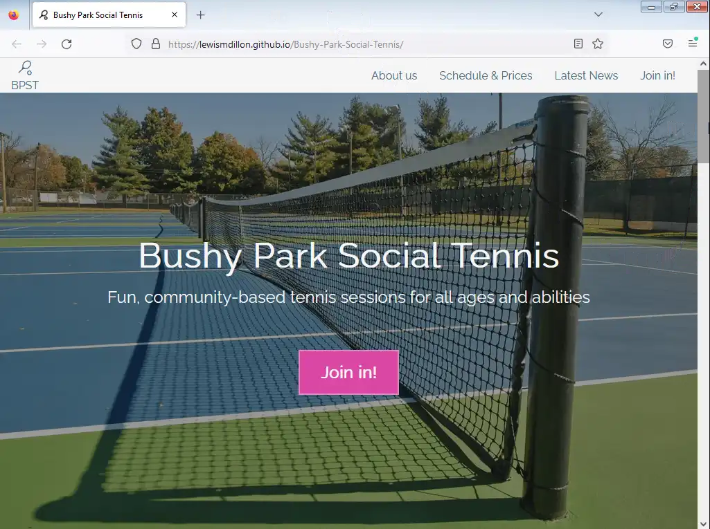
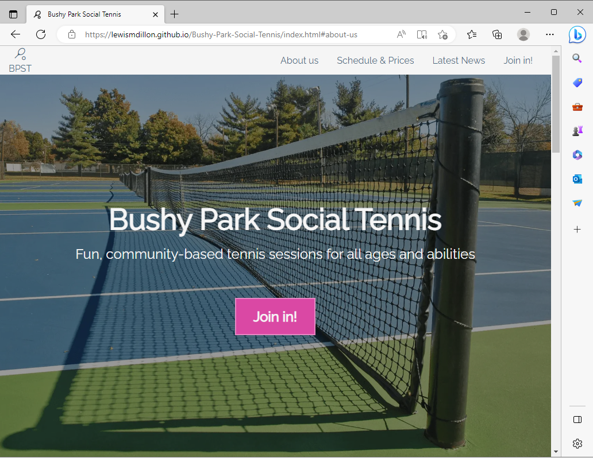
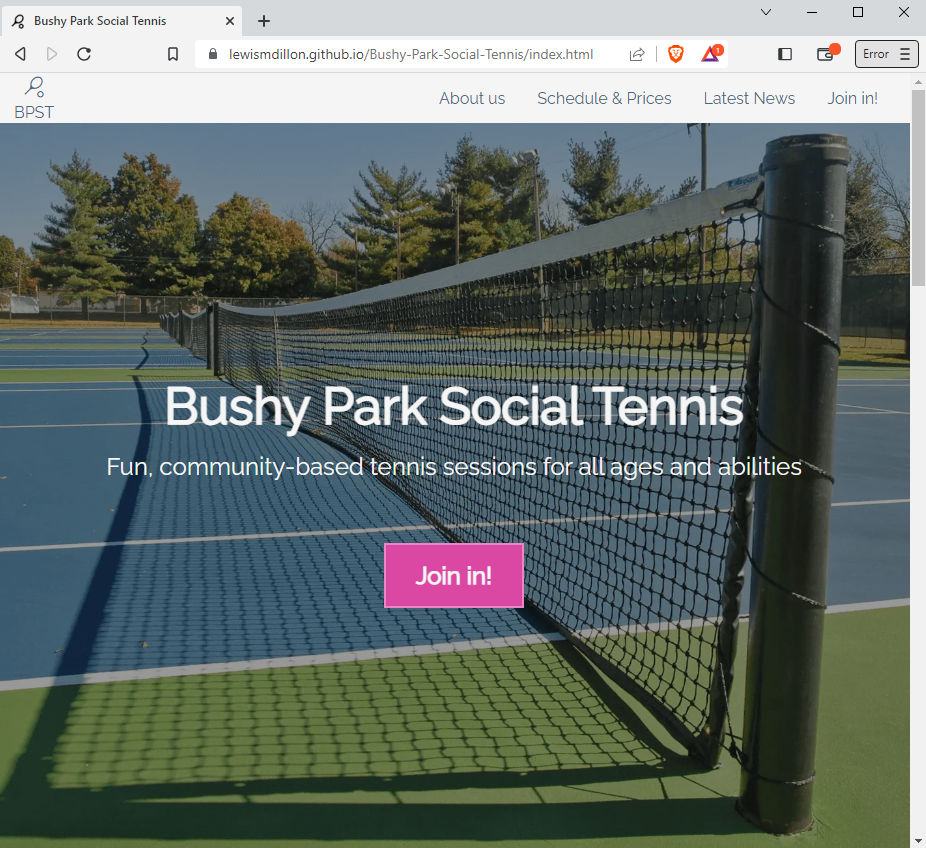
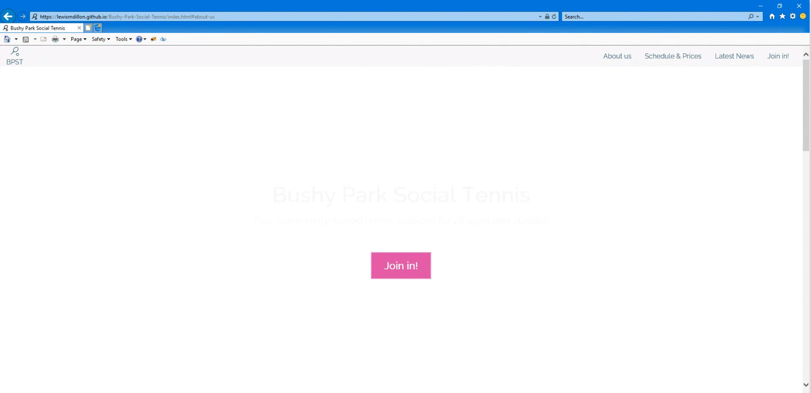
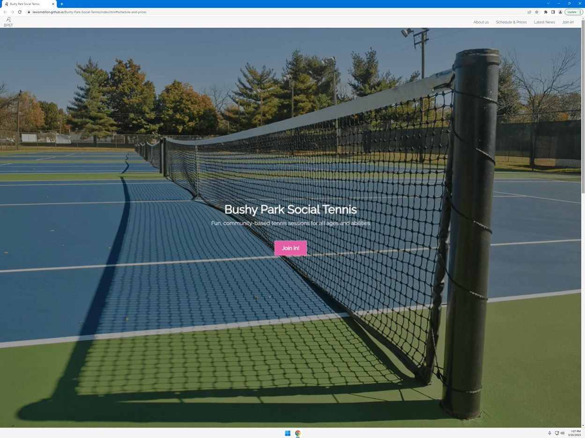
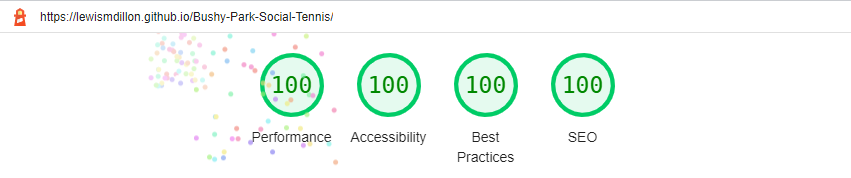
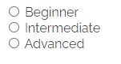
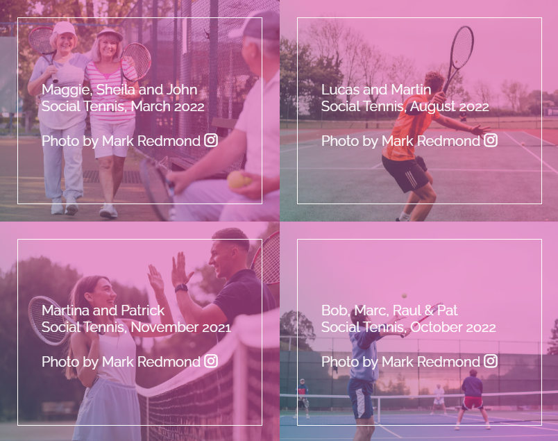
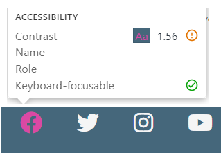
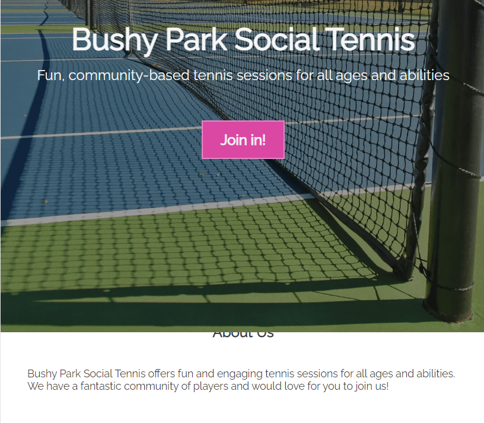

# Testing

Return back to the [README.md](README.md) file.

⚠️⚠️⚠️⚠️⚠️ START OF NOTES (to be deleted) ⚠️⚠️⚠️⚠️⚠️

In this section, you need to convince the assessors that you have conducted enough testing to legitimately believe that the site works well.
Essentially, in this part, you should go over all of your project's features, and ensure that they all work as intended,
with the project providing an easy and straightforward way for the users to achieve their goals.

🛑🛑🛑🛑🛑 END OF NOTES (to be deleted) 🛑🛑🛑🛑🛑

## Code Validation

⚠️⚠️⚠️⚠️⚠️ START OF NOTES (to be deleted) ⚠️⚠️⚠️⚠️⚠️

Use the space to discuss code validation for any of your own code files (where applicable).
You are not required to validate external libraries/frameworks, such as imported Bootstrap, Materialize, Font Awesome, etc.

**IMPORTANT**: You must provide a screenshot for each file you validate.

**PRO TIP**: Always validate the live site pages, not your local code. There could be subtle/hidden differences.

🛑🛑🛑🛑🛑 END OF NOTES (to be deleted) 🛑🛑🛑🛑🛑

### HTML

I have used the recommended [HTML W3C Validator](https://validator.w3.org) to validate all of my HTML files.

⚠️⚠️⚠️⚠️⚠️ START OF NOTES (to be deleted) ⚠️⚠️⚠️⚠️⚠️

- If you are copying/pasting your HTML code, use this link: https://validator.w3.org/#validate_by_input
- (*recommended*) If you are using the live deployed site pages, use this link: https://validator.w3.org/#validate_by_uri

It's recommended to validate the live pages (each of them) using the deployed URL.
This will give you a custom URL as well, which you can use on your testing documentation.
It makes it easier to return back to a page to validate it again in the future.
The URL will look something like this:

- https://validator.w3.org/nu/?doc=https%3A%2F%2FLewisMDillon.github.io%2FBushy-Park-Social-Tennis%2Findex.html

Sample HTML code validation documentation (tables are extremely helpful!):

🛑🛑🛑🛑🛑 END OF NOTES (to be deleted) 🛑🛑🛑🛑🛑

| Page | W3C URL | Screenshot | Notes |
| --- | --- | --- | --- |
| Home | [W3C](https://validator.w3.org/nu/?doc=https%3A%2F%2FLewisMDillon.github.io%2FBushy-Park-Social-Tennis%2Findex.html) |  | Section lacks header h2-h6 warning |
| Contact | [W3C](https://validator.w3.org/nu/?doc=https%3A%2F%2FLewisMDillon.github.io%2FBushy-Park-Social-Tennis%2Fcontact.html) |  | obsolete iframe warnings |
| Quiz | [W3C](https://validator.w3.org/nu/?doc=https%3A%2F%2FLewisMDillon.github.io%2FBushy-Park-Social-Tennis%2Fquiz.html) |  | Pass: No Errors |
| Add Blog | n/a |  | Duplicate IDs found, and fixed |
| Checkout | n/a |  | Pass: No Errors |
| x | x | x | repeat for all remaining HTML files |

### CSS

I have used the recommended [CSS Jigsaw Validator](https://jigsaw.w3.org/css-validator) to validate all of my CSS files.

⚠️⚠️⚠️⚠️⚠️ START OF NOTES (to be deleted) ⚠️⚠️⚠️⚠️⚠️

- If you are copying/pasting your HTML code, use this link: https://jigsaw.w3.org/css-validator/#validate_by_input
- (*recommended*) If you are using the live deployed site, use this link: https://jigsaw.w3.org/css-validator/#validate_by_uri

It's recommended to validate the live site if you only have a single CSS file using the deployed URL.
This will give you a custom URL as well, which you can use on your testing documentation.
It makes it easier to return back to the page to validate it again in the future.
The URL will look something like this:

- https://jigsaw.w3.org/css-validator/validator?uri=https%3A%2F%2FLewisMDillon.github.io%2FBushy-Park-Social-Tennis

If you have multiple CSS files, then individual [validation by input](https://jigsaw.w3.org/css-validator/#validate_by_input)
is recommended for the additional CSS files.

**IMPORTANT**: Third-Party tools

If you're using extras like Bootstrap, Materialize, Font Awesome, then sometimes the validator
will attempt to also validate this code, even if it's not part of your own actual code.
You are not required to validate the external libraries or frameworks!

Sample CSS code validation documentation (tables are extremely helpful!):

🛑🛑🛑🛑🛑 END OF NOTES (to be deleted) 🛑🛑🛑🛑🛑

| File | Jigsaw URL | Screenshot | Notes |
| --- | --- | --- | --- |
| style.css | [Jigsaw](https://jigsaw.w3.org/css-validator/validator?uri=https%3A%2F%2FLewisMDillon.github.io%2FBushy-Park-Social-Tennis) |  | Pass: No Errors |
| checkout.css | n/a |  | Pass: No Errors |
| x | x | x | repeat for all remaining CSS files |

## Browser Compatibility

⚠️⚠️⚠️⚠️⚠️ START OF NOTES (to be deleted) ⚠️⚠️⚠️⚠️⚠️

Use this space to discuss testing the live/deployed site on various browsers.

Consider testing at least 3 different browsers, if available on your system.

Recommended browsers to consider:
- [Chrome](https://www.google.com/chrome)
- [Firefox (Developer Edition)](https://www.mozilla.org/firefox/developer)
- [Edge](https://www.microsoft.com/edge)
- [Safari](https://support.apple.com/downloads/safari)
- [Brave](https://brave.com/download)
- [Opera](https://www.opera.com/download)

**IMPORTANT**: You must provide screenshots of the tested browsers, to "prove" that you've actually tested them.

Please note, there are services out there that can test multiple browser compatibilities at the same time.
Some of these are paid services, but some are free.
If you use these, you must provide a link to the source used for attribution, and multiple screenshots of the results.

Sample browser testing documentation:

🛑🛑🛑🛑🛑 END OF NOTES (to be deleted) 🛑🛑🛑🛑🛑

I've tested my deployed project on multiple browsers to check for compatibility issues.

| Browser | Screenshot | Notes |
| --- | --- | --- |
| Chrome |  | Works as expected |
| Firefox |  | Works as expected |
| Edge |  | Works as expected |
| Safari |  | Minor CSS differences |
| Brave |  | Works as expected |
| Opera |  | Minor differences |
| Internet Explorer |  | Does not work as expected |
| x | x | repeat for any other tested browsers |

## Responsiveness

⚠️⚠️⚠️⚠️⚠️ START OF NOTES (to be deleted) ⚠️⚠️⚠️⚠️⚠️

Use this space to discuss testing the live/deployed site on various device sizes.

The minimum requirement is for the following 3 tests:
- Mobile
- Tablet
- Desktop

**IMPORTANT**: You must provide screenshots of the tested responsiveness, to "prove" that you've actually tested them.

Using the "amiresponsive" mockup image (or similar) does not suffice the requirements.
Consider using some of the built-in device sizes in the Developer Tools.

If you have tested the project on your actual mobile phone or tablet, consider also including screenshots of these as well.
It showcases a higher level of manual tests, and can be seen as a positive inclusion!

Sample responsiveness testing documentation:

🛑🛑🛑🛑🛑 END OF NOTES (to be deleted) 🛑🛑🛑🛑🛑

I've tested my deployed project on multiple devices to check for responsiveness issues.

| Device | Screenshot | Notes |
| --- | --- | --- |
| Mobile (DevTools) |  | Works as expected |
| Tablet (DevTools) |  | Works as expected |
| Desktop |  | Works as expected |
| XL Monitor |  | Scaling starts to have minor issues |
| 4K Monitor |  | Noticeable scaling issues |
| Google Pixel 7 Pro |  | Works as expected |
| iPhone 14 |  | Works as expected |
| x | x | repeat for any other tested sizes |

## Lighthouse Audit

⚠️⚠️⚠️⚠️⚠️ START OF NOTES (to be deleted) ⚠️⚠️⚠️⚠️⚠️

Use this space to discuss testing the live/deployed site's Lighthouse Audit reports.
Avoid testing the local version (especially if developing in Gitpod), as this can have knock-on effects of performance.

If you don't have Lighthouse in your Developer Tools,
it can be added as an [extension](https://chrome.google.com/webstore/detail/lighthouse/blipmdconlkpinefehnmjammfjpmpbjk).

Don't just test the home page (unless it's a single-page application).
Make sure to test the Lighthouse Audit results for all of your pages.

**IMPORTANT**: You must provide screenshots of the results, to "prove" that you've actually tested them.

Sample Lighthouse testing documentation:

🛑🛑🛑🛑🛑 END OF NOTES (to be deleted) 🛑🛑🛑🛑🛑

I've tested my deployed project using the Lighthouse Audit tool to check for any major issues.

| Page | Size | Screenshot | Notes |
| --- | --- | --- | --- |
| Home | Mobile |  | Some minor warnings |
| Home | Desktop |  | Few warnings |
| About | Mobile |  | Some minor warnings |
| About | Desktop |  | Few warnings |
| Gallery | Mobile |  | Slow response time due to large images |
| Gallery | Desktop |  | Slow response time due to large images |
| x | x | x | repeat for any other tested pages/sizes |

## Bugs

⚠️⚠️⚠️⚠️⚠️ START OF NOTES (to be deleted) ⚠️⚠️⚠️⚠️⚠️

It's very important to document any bugs you've discovered while developing the project.
Make sure to include any necessary steps you've implemented to fix the bug(s) as well.

For JavaScript and Python applications, it's best to screenshot the errors to include them as well.

**PRO TIP**: screenshots of bugs are extremely helpful, and go a long way!

🛑🛑🛑🛑🛑 END OF NOTES (to be deleted) 🛑🛑🛑🛑🛑

- JS Uncaught ReferenceError: `foobar` is undefined/not defined

    

    - To fix this, I _____________________.

- JS `'let'` or `'const'` or `'template literal syntax'` or `'arrow function syntax (=>)'` is available in ES6 (use `'esversion: 11'`) or Mozilla JS extensions (use moz).

    

    - To fix this, I _____________________.

- Python `'ModuleNotFoundError'` when trying to import module from imported package

    

    - To fix this, I _____________________.

- Django `TemplateDoesNotExist` at /appname/path appname/template_name.html

    

    - To fix this, I _____________________.

- Python `E501 line too long` (93 > 79 characters)

    

    - To fix this, I _____________________.

### GitHub **Issues**

⚠️⚠️⚠️⚠️⚠️ START OF NOTES (to be deleted) ⚠️⚠️⚠️⚠️⚠️

An improved way to manage bugs is to use the built-in **Issues** tracker on your GitHub repository.
To access your Issues, click on the "Issues" tab at the top of your repository.
Alternatively, use this link: https://github.com/LewisMDillon/Bushy-Park-Social-Tennis/issues

If using the Issues tracker for your bug management, you can simplify the documentation process.
Issues allow you to directly paste screenshots into the issue without having to first save the screenshot locally,
then uploading into your project.

You can add labels to your issues (`bug`), assign yourself as the owner, and add comments/updates as you progress with fixing the issue(s).

Once you've sorted the issue, you should then "Close" it.

When showcasing your bug tracking for assessment, you can use the following format:

🛑🛑🛑🛑🛑 END OF NOTES (to be deleted) 🛑🛑🛑🛑🛑

**Fixed Bugs**

All previously closed/fixed bugs can be tracked [here](https://github.com/LewisMDillon/Bushy-Park-Social-Tennis/issues?q=is%3Aissue+is%3Aclosed).

| Bug | Status |
| --- | --- |
| [JS Uncaught ReferenceError: `foobar` is undefined/not defined](https://github.com/LewisMDillon/Bushy-Park-Social-Tennis/issues/1) | Closed |
| [Python `'ModuleNotFoundError'` when trying to import module from imported package](https://github.com/LewisMDillon/Bushy-Park-Social-Tennis/issues/2) | Closed |
| [Django `TemplateDoesNotExist` at /appname/path appname/template_name.html](https://github.com/LewisMDillon/Bushy-Park-Social-Tennis/issues/3) | Closed |

**Open Issues**

Any remaining open issues can be tracked [here](https://github.com/LewisMDillon/Bushy-Park-Social-Tennis/issues).

| Bug | Status |
| --- | --- |
| [JS `'let'` or `'const'` or `'template literal syntax'` or `'arrow function syntax (=>)'` is available in ES6 (use `'esversion: 11'`) or Mozilla JS extensions (use moz).](https://github.com/LewisMDillon/Bushy-Park-Social-Tennis/issues/4) | Open |
| [Python `E501 line too long` (93 > 79 characters)](https://github.com/LewisMDillon/Bushy-Park-Social-Tennis/issues/5) | Open |

## Unfixed Bugs

⚠️⚠️⚠️⚠️⚠️ START OF NOTES (to be deleted) ⚠️⚠️⚠️⚠️⚠️

You will need to mention unfixed bugs and why they were not fixed.
This section should include shortcomings of the frameworks or technologies used.
Although time can be a big variable to consider, paucity of time and difficulty understanding
implementation is not a valid reason to leave bugs unfixed.

If you've identified any unfixed bugs, no matter how small, be sure to list them here.
It's better to be honest and list them, because if it's not documented and an assessor finds the issue,
they need to know whether or not you're aware of them as well, and why you've not corrected/fixed them.

Some examples:

🛑🛑🛑🛑🛑 END OF NOTES (to be deleted) 🛑🛑🛑🛑🛑

- On devices smaller than 375px, the page starts to have `overflow-x` scrolling.

    

    - Attempted fix: I tried to add additional media queries to handle this, but things started becoming too small to read.

- For PP3, when using a helper `clear()` function, any text above the height of the terminal does not clear, and remains when you scroll up.

    

    - Attempted fix: I tried to adjust the terminal size, but it only resizes the actual terminal, not the allowable area for text.

- When validating HTML with a semantic `section` element, the validator warns about lacking a header `h2-h6`. This is acceptable.

    

    - Attempted fix: this is a known warning and acceptable, and my section doesn't require a header since it's dynamically added via JS.

⚠️⚠️⚠️⚠️⚠️ START OF NOTES (to be deleted) ⚠️⚠️⚠️⚠️⚠️

If you legitimately cannot find any unfixed bugs or warnings, then use the following sentence:

🛑🛑🛑🛑🛑 END OF NOTES (to be deleted) 🛑🛑🛑🛑🛑

There are no remaining bugs that I am aware of.
